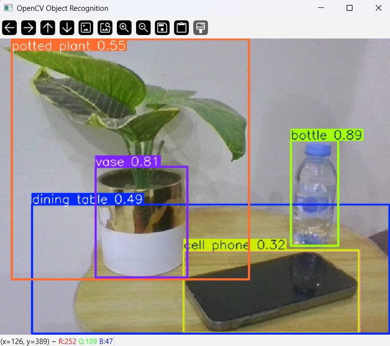

# OpenCV Object Recognition

A real-time object recognition application built with **Python**, **OpenCV**, and **YOLOv8**. The application uses a webcam to detect and recognize multiple objects, displaying bounding boxes and class labels in real time.

---

## Features

- Real-time webcam object detection
- Multiple object recognition
- Bounding boxes with object labels
- Fast YOLOv8 inference
- Simple and lightweight implementation

---

## Technologies

- Python
- OpenCV
- Ultralytics YOLOv8
- NumPy

---

## How It Works

1. Load the YOLOv8 model.
2. Access the webcam using OpenCV.
3. Capture video frames continuously.
4. Detect objects in each frame.
5. Draw bounding boxes and object labels.
6. Display the processed video stream in real time.

---

## Supported Objects

The model can recognize many everyday objects, including:

- Person
- Bottle
- Laptop
- Cell Phone
- Chair
- Keyboard
- Mouse
- TV
- Book
- Cup

and many more.

---

## Demo

### Screenshot

### GIF Preview

---

## Future Improvements

- Confidence threshold adjustment
- FPS counter
- Save detection results
- Image and video file detection
- Custom-trained YOLO models

---

## License

This project is available under the MIT License.
